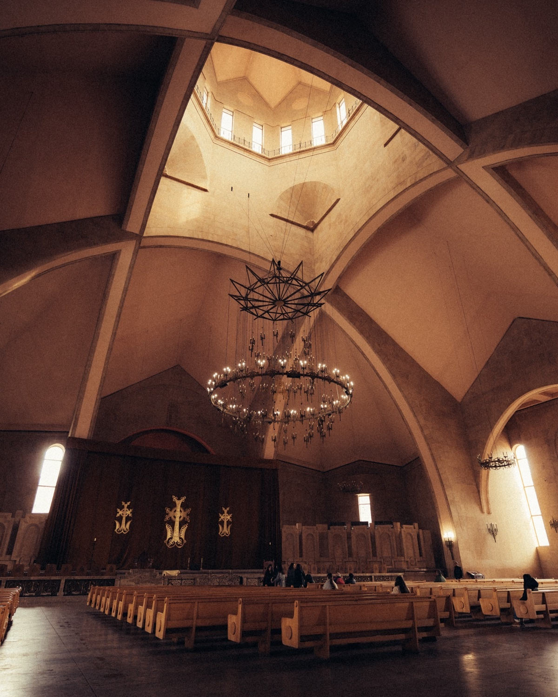
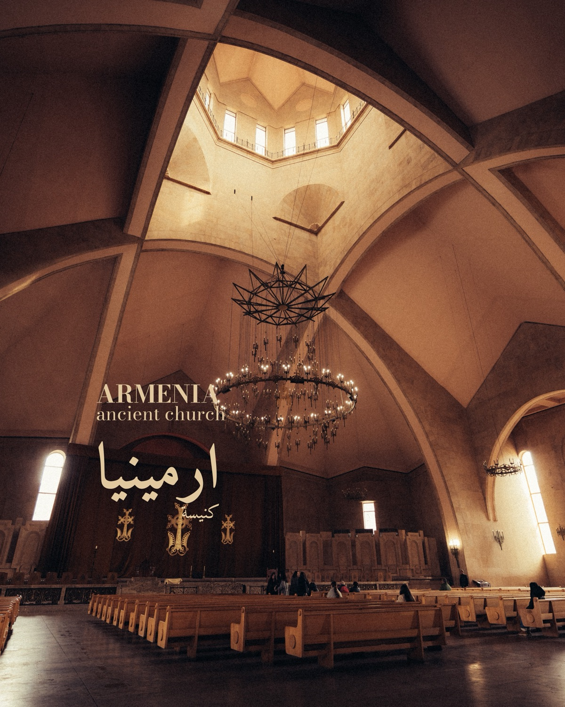

# Naqsh (نقش)

I built this to speed up my social media workflow. It's a [Claude Code](https://docs.anthropic.com/en/docs/claude-code) slash command that uses helper Python scripts to generate bilingual (English + Arabic) text overlays on photos — with AI-driven color, font, and placement decisions.

## Example

| Original | With Overlay |
|----------|--------------|
|  |  |

> The AI analyzed the church interior, extracted the warm golden palette, chose a matching amber tone for the text, picked an architectural font pair (Clash Display + Tajawal), and placed the text in the left region to avoid covering the chandelier.

## Usage

Open the project directory in Claude Code and use the `/text-overlay` slash command:

```
/text-overlay "ARMENIA" --text-ar "ارمينيا" --subtext "ancient church" --subtext-ar "كنيسة" --image tests/armenia-church.jpg
```

### Arguments

| Argument | Required | Description |
|----------|----------|-------------|
| `--text` or first quoted string | Yes* | English headline text |
| `--text-ar` | Yes* | Arabic headline text |
| `--subtext` | No | English subtext |
| `--subtext-ar` | No | Arabic subtext |
| `--image` | Yes | Path to image (JPEG, PNG, or RAW) |
| `--layout` | No | `auto` (side placement, default) or `center` |

*At least one of `--text` or `--text-ar` is required.

### Iteration

After generating an overlay, give natural language feedback to refine it:

- "move it up" / "move it to the left"
- "make the color more golden"
- "try a different font"
- "add a shadow"
- "bigger subtext"
- "tighter line spacing"

The system preserves state between iterations so simple tweaks re-render instantly without re-running the full pipeline.

## How It Works

The `/text-overlay` slash command orchestrates a multi-phase pipeline:

1. **Analyze** the image — a Python script extracts the color palette, identifies regions, and scores placement candidates
2. **Creative Director** (Opus sub-agent) — sees the actual image + analysis data, then makes all aesthetic decisions: font pair, text color, rectangle placement, sizing, and row order
3. **Render** — a Python script takes the decisions JSON and produces a lossless PNG with full Arabic BiDi text shaping

### How the AI Makes Decisions

The Creative Director sub-agent receives the image + analysis data and decides:

- **Color**: Picked from palette-derived candidates (never generic white). Warm images get warm tones, cool images get cool tones. Minimum 2.5:1 contrast ratio.
- **Font**: Matched by scene type (travel, architecture, food, etc.) and mood (energetic, calm, luxurious, etc.) from a manifest of 15 curated bilingual font pairs.
- **Placement**: From pre-scored rectangle candidates that avoid busy regions. Can be nudged for creative override.
- **Readability**: Defaults to none — good color choices handle readability. Shadow/stroke/gradient only added when contrast is critically low.

### Font Pairs

15 bilingual font pairs organized by style:

| Category | Pairs | Example |
|----------|-------|---------|
| Bold/Impact | 5 | Bebas Neue + Almarai, Oswald + Noto Sans Arabic |
| Modern/Clean | 5 | Clash Display + Tajawal, Satoshi + IBM Plex Sans Arabic |
| Elegant/Editorial | 3 | Bodoni Moda + Amiri, DM Sans + Tajawal |
| Versatile | 2 | Outfit + Noto Sans Arabic, Switzer + El Messiri |

Each pair is tagged with mood and scene metadata so the AI can match fonts to the image content.

## Setup

```bash
# Clone the repo
git clone <repo-url>
cd naqsh

# Install Python dependencies
pip install -r requirements.txt

# Download fonts (29 families from Google Fonts + Fontshare)
python3 fonts/download_fonts.py
```

The font downloader fetches all font families from Google Fonts and Fontshare automatically. Supports JPEG, PNG, and RAW formats (ARW, CR2, NEF, DNG, etc. — RAW conversion uses macOS `sips`).

## Project Structure

```
.
├── scripts/
│   ├── analyze.py            # Image analysis (palette, regions, placements)
│   ├── render.py              # Text rendering engine with Arabic BiDi
│   └── test_arabic_fonts.py   # Font glyph coverage testing
├── fonts/
│   ├── manifest.json          # 15 font pair definitions with mood/scene tags
│   ├── download_fonts.py      # Downloads all 29 font families
│   ├── english/               # English .ttf files (gitignored, downloaded)
│   └── arabic/                # Arabic .ttf files (gitignored, downloaded)
├── examples/                    # Compressed example images for README
├── .claude/
│   └── commands/
│       └── text-overlay.md    # The slash command (full pipeline orchestration)
├── requirements.txt
└── CLAUDE.md                  # Project context for Claude Code
```
